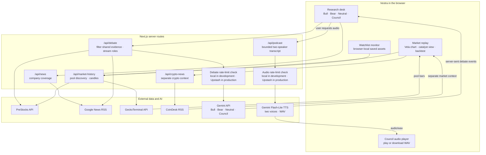

# Vestra

**Vestra helps PreStocks researchers compare company headlines with Solana pool activity, hear Bull, Bear, and Neutral cases, and review the Council’s evidence-based read.**

PreStocks tokens represent exposure to private-company outcomes. They are not company shares and do not provide IPO allocation. Vestra is a research tool, not a trading venue or investment recommendation.

## What it does

- **Research:** select a supported PreStocks asset and review its current catalogue snapshot and company-linked headlines.
- **Bull vs. Bear:** Bull, Bear, and Neutral analysts read the same server-fetched evidence. A Council then checks the arguments against those headlines and summarizes the supported read, agreement, disagreement, unknowns, and what could change it. The debate streams into the UI as each role completes.
- **Council audio:** create an on-demand, two-voice WAV brief from the Council readout, then play or download it. Speech uses Gemini Flash-Lite TTS and the existing server-side Gemini key.
- **Market replay:** inspect discovered Solana pool candles in LuxAlgo Vela, compare dated headlines with neighboring closes, and view a simple 5/20-day moving-average simulation with execution-cost assumptions.
- **Market context:** see pool liquidity and volume alongside a disclosed quote-to-mark check. CoinDesk crypto headlines are shown separately from company evidence.
- **Watchlist checks:** saved assets stay in browser storage. While the app is open, it periodically checks up to five saved assets for quote movement and market-quality warnings.

## Architecture



### Data boundaries

- PreStocks provides the supported asset catalogue and its displayed quote/mark data. GeckoTerminal supplies discovered pool candles, liquidity, and volume. Pool prices are not interchangeable with PreStocks catalogue prices.
- Company headlines are fetched and filtered on the server. Bull, Bear, Neutral, and Council use that same bounded headline packet; headline metadata is not full article text. Broad crypto headlines remain outside the company debate evidence.
- Debate claims are model-generated analysis, not verified facts or price forecasts. Source links are shown where the model provides valid evidence IDs. A model-specific quota or provider outage can still stop a run; Vestra retries a 429/quota or temporary provider failure once with the configured lower-tier model.
- The backtest is a descriptive moving-average simulation over the discovered pool’s available candles. It does not model pool depth, price impact, taxes, or a PreStocks mark-price conversion. Missing pool days can affect the calendar span. Past results do not predict future results.
- The audio brief reads the existing Council result; it does not create a new conclusion. Gemini’s free tier may use prompts to improve Google products, so only public company and market research is sent. TTS availability and free quota depend on the Google AI Studio project.
- Watchlist entries are stored in this browser. Checks run only while the app is open; this version has no Telegram or background push alerts.

## Run locally

Requirements: Node.js 20.9 or newer.

```bash
npm install
cp .env.example .env.local
npm run dev
```

Add `GEMINI_API_KEY` to `.env.local` to enable live debate and Council audio. Keep it server-side; never use a `NEXT_PUBLIC_` prefix or commit the local environment file. Other model settings are optional:

| Variable | Default | Purpose |
| --- | --- | --- |
| `GEMINI_MODEL` | `gemini-3.5-flash-lite` | Default analyst model |
| `GEMINI_FALLBACK_MODEL` | `gemini-3.1-flash-lite` | One retry after quota or temporary provider failures |
| `GEMINI_BULL_MODEL` | `GEMINI_MODEL` | Optional Bull model override |
| `GEMINI_BEAR_MODEL` | `gemini-3.7-flash` | Optional Bear model override |
| `GEMINI_NEUTRAL_MODEL` | `GEMINI_MODEL` | Optional Neutral model override |
| `GEMINI_COUNCIL_MODEL` | `gemini-3.8-flash` | Council synthesis model |
| `GEMINI_TTS_MODEL` | `gemini-3.8-flash-lite-tts` | On-demand speech model |
| `NEWS_MAX_RECORDS` | `12` | Company headline results, capped at 20 |

For production, configure `UPSTASH_REDIS_REST_URL`, `UPSTASH_REDIS_REST_TOKEN`, and a private `RATE_LIMIT_HASH_SALT` of at least 32 characters. Debate and audio requests fail closed without production rate-limit configuration. Vestra HMAC-hashes trusted client IPs before sending identifiers to Upstash.

## Demo flow

1. Open **Research**, select a PreStocks company, and scan its quote/mark snapshot and linked headlines.
2. Run the debate. Show the Bull, Bear, and Neutral cases, then the Council synthesis and citations.
3. Select **Create audio brief** in the Council card to play or download the two-voice summary.
4. Open **Market replay** to inspect the selected asset’s discovered pool, compare a dated headline with nearby closes, and explain the moving-average simulation’s limits.
5. Save an asset and show the watchlist monitor while the app remains open.

## Build

```bash
npm run lint
npm run build
npm start
```

## References

- [Stocklana](https://hackathons.solana.com/hackathons/stocklana)
- [PreStocks API](https://prestocks.com/api/prestocks) · [PreStocks disclosures](https://prestocks.com/products)
- [Google Gemini speech generation](https://ai.google.dev/gemini-api/docs/speech-generation) · [Gemini pricing](https://ai.google.dev/gemini-api/docs/pricing)
- [Gemini API rate limits](https://ai.google.dev/gemini-api/docs/rate-limits) · [Google GenAI SDK](https://ai.google.dev/gemini-api/docs/libraries)
- [GeckoTerminal API](https://api.geckoterminal.com/docs/index.html) · [LuxAlgo Vela](https://luxalgo.com/vela)
- [CoinDesk RSS](https://www.coindesk.com/coindesk-news/2021/09/17/coindesk-rss)
